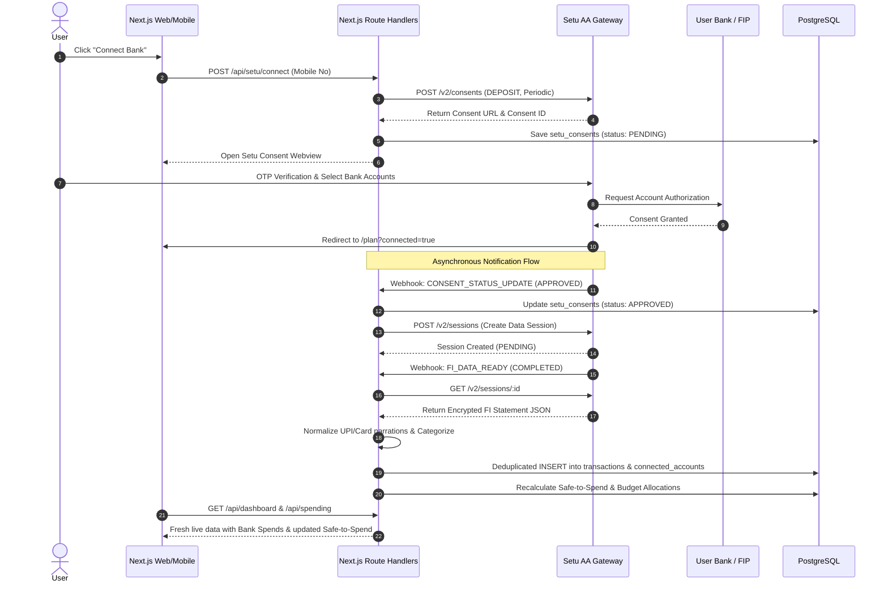
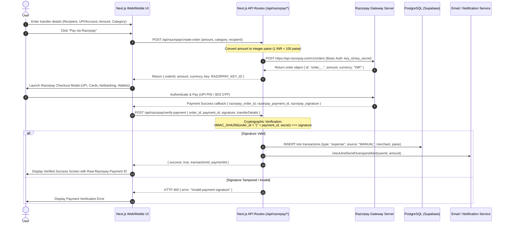

# System Design & Architecture Document
## Personal Finance Assistant (IBM SkillsBuild Hackathon Project)

---

## 1. Executive Summary & Core Philosophy

Traditional financial apps are either **passive expense trackers** (forcing tedious manual bookkeeping) or **black-box bots** that give generic advice without deterministic guarantees. 

Our application is built as an **Intelligent Financial Decision Engine** powered by:
1. **India's Account Aggregator (AA) Ecosystem** via Setu Gateway for automated, consent-driven bank & UPI data fetching.
2. **Deterministic Financial Calculation Engine** ensuring that money arithmetic, budget allocations, safe-to-spend limits, and emergency runways are 100% mathematically accurate and verifiable.
3. **Structured Financial Context Injection** ensuring zero AI math hallucinations by feeding pre-computed deterministic facts directly into prompt context.
4. **IBM Watsonx.ai (Granite 3.0 / 3.1 Instruct)** cognitive intelligence layer translating numerical states into empathetic, actionable human guidance and "Can I Afford This?" decision simulations.

---

## 2. High-Level Architecture Diagram

```mermaid
graph TD
    User([User Device / Mobile WebView / Web App])
    
    subgraph Frontend_Layer [Next.js 16 Client & UI]
        UI_Home[Home / Safe-to-Spend & Copilot Launcher]
        UI_Money[Money / Cashflow & Donut]
        UI_Plan[Plan / Allocations & Limits]
        UI_Goals[Goals & Contributions]
        UI_Insights[AI Insights & Advisor Chat]
        UI_Sim[Purchase Simulator Modal]
        UI_Profile[Profile & Dynamic Themes]
    end

    subgraph Backend_Gateway [Next.js Route Handlers & Auth]
        Auth[Auth.js / Google OAuth 2.0]
        API_Dash[/api/dashboard]
        API_Tx[/api/transactions]
        API_Plan[/api/plans]
        API_Setu[/api/setu/*]
        API_AI_Chat[/api/ai/chat]
        API_AI_Sim[/api/ai/simulate]
    end

    subgraph Deterministic_Financial_Engine [Deterministic Core Logic]
        Engine_Safe[Safe-to-Spend Calculator]
        Engine_Alloc[50/20/20/10 Budget Allocator]
        Engine_Limits[Category Limit & Overspend Detector]
        Engine_Emergency[Emergency Runway Analyzer]
        Engine_Sim[Purchase Impact Simulator]
        Engine_Goal[Goal Velocity & Rebalancer]
    end

    subgraph Context_Grounding_Layer [Structured Context Injector]
        Context_Aggregator[Live User Snapshot & Metric Aggregator]
        Prompt_Builder[Grounded Fact & Guardrails Assembler]
    end

    subgraph Cognitive_AI_Layer [IBM Watsonx.ai Integration]
        Granite_Engine[IBM Granite 3.0 / 3.1 Instruct]
        Advice_Synthesizer[Actionable Decision & Plan Recovery Synthesizer]
    end

    subgraph Storage_Layer [Supabase PostgreSQL DB]
        DB_Users[(auth_users)]
        DB_Profiles[(financial_profiles)]
        DB_Plans[(plans & plan_allocations)]
        DB_Tx[(transactions & limits)]
        DB_Goals[(goals & goal_contributions)]
        DB_AA[(connected_accounts & setu_consents)]
        DB_Insights[(insights)]
    end

    User --> Frontend_Layer
    Frontend_Layer --> Backend_Gateway
    Backend_Gateway --> Auth
    Backend_Gateway --> Deterministic_Financial_Engine
    Backend_Gateway --> Context_Grounding_Layer
    Context_Grounding_Layer --> Cognitive_AI_Layer

    Deterministic_Financial_Engine --> Storage_Layer
    Context_Grounding_Layer --> Storage_Layer
    Cognitive_AI_Layer --> Storage_Layer

    Backend_Gateway -.->|RBI AA Protocol| External_Banks[(Banks & FIPs via Setu)]
    Cognitive_AI_Layer -.->|REST API / SDK| IBM_Watsonx[(IBM Cloud Watsonx.ai)]
```

---

## 3. Structured Financial Context Injection (Zero-Hallucination Architecture)

```
User Query: "Can I buy a ₹15,000 phone this month?"
       │
       ▼
SQL Query (Drizzle) ──► Fetches Real Facts:
                          • Monthly Income: ₹50,000
                          • Spent this month: ₹28,400
                          • Current Daily Safe-to-Spend: ₹720/day
                          • Goa Goal: ₹15,000 / ₹40,000
       │
       ▼
Deterministic Simulator ──► Pre-computes Exact Math:
                          • New Daily Safe-to-Spend: drops to ₹220/day
                          • Goal Delay: 14 days
                          • Feasibility Status: Risky (requires ₹2,000 budget cut in Food/Shopping)
       │
       ▼
IBM Granite 3.0 LLM ──► Synthesizes empathetic explanation and trade-off options!
```

---

## 4. High-Level Pseudocode

### A. Context Aggregator & Purchase Simulator

```typescript
// Algorithm: Structured Context Aggregator & Deterministic Simulation
export async function getStructuredFinancialContext(userId: string) {
  const profile = await db.query.financialProfiles.findFirst({ where: eq(financialProfiles.userId, userId) });
  const incomePaise = profile?.monthlyIncome ?? 0;

  const now = new Date();
  const year = now.getFullYear();
  const month = now.getMonth() + 1;
  const startStr = `${year}-${String(month).padStart(2, "0")}-01`;
  const lastDay = new Date(year, month, 0).getDate();
  const endStr = `${year}-${String(month).padStart(2, "0")}-${String(lastDay).padStart(2, "0")}`;

  const categorySpends = await db.getMonthlyCategorySpend(userId, startStr, endStr);
  const totalSpentPaise = categorySpends.reduce((s, c) => s + c.amount, 0);

  const daysRemaining = Math.max(1, lastDay - now.getDate() + 1);
  const remainingBudgetPaise = Math.max(0, incomePaise - totalSpentPaise);
  const dailySafeToSpendRupees = Math.round((remainingBudgetPaise / daysRemaining) / 100);

  const goals = await db.getUserGoals(userId);

  return {
    incomeRupees: Math.round(incomePaise / 100),
    spentRupees: Math.round(totalSpentPaise / 100),
    remainingDays: daysRemaining,
    dailySafeToSpendRupees,
    byCategory: categorySpends.map(c => ({ category: c.category, amountRupees: Math.round(c.amount / 100) })),
    goals: goals.map(g => ({ name: g.name, currentRupees: Math.round(g.currentAmount / 100), targetRupees: Math.round(g.targetAmount / 100) }))
  };
}

export function simulatePurchaseImpact(context, purchaseAmountRupees) {
  const purchasePaise = purchaseAmountRupees * 100;
  const currentRemainingPaise = (context.incomeRupees - context.spentRupees) * 100;
  const newRemainingPaise = Math.max(0, currentRemainingPaise - purchasePaise);
  const newDailySafeToSpend = Math.round((newRemainingPaise / context.remainingDays) / 100);

  const isAffordable = currentRemainingPaise >= purchasePaise && newDailySafeToSpend >= 150;
  const reductionPercent = context.dailySafeToSpendRupees > 0 
    ? Math.round(((context.dailySafeToSpendRupees - newDailySafeToSpend) / context.dailySafeToSpendRupees) * 100)
    : 100;

  return {
    purchaseAmountRupees,
    originalDailySafeToSpend: context.dailySafeToSpendRupees,
    newDailySafeToSpend,
    dailyDropRupees: context.dailySafeToSpendRupees - newDailySafeToSpend,
    reductionPercent,
    isAffordable
  };
}
```

---

### B. IBM Watsonx Granite AI Agent

```typescript
// Algorithm: Grounded IBM Granite Generation
export async function generateGraniteAdvisorResponse(userQuery: string, context: StructuredContext) {
  const prompt = `
You are the AI Financial Copilot powered by IBM watsonx.ai and IBM Granite 3.0.
Your goal is to provide concise, empathetic, and actionable financial decision support.

VERIFIED FACTS (GROUNDING DATA - DO NOT HALLUCINATE OR CHANGE NUMBERS):
- Monthly Income: ₹${context.incomeRupees.toLocaleString("en-IN")}
- Total Spent This Month: ₹${context.spentRupees.toLocaleString("en-IN")}
- Daily Safe-to-Spend: ₹${context.dailySafeToSpendRupees}/day (${context.remainingDays} days left in month)
- Category Spend: ${JSON.stringify(context.byCategory)}
- Active Goals: ${context.goals.map(g => `${g.name}: ₹${g.currentRupees}/₹${g.targetRupees}`).join(", ") || "None"}

USER QUESTION: "${userQuery}"

INSTRUCTIONS:
1. Answer directly and concisely (max 3 short paragraphs).
2. Reference the exact numbers from the verified facts above.
3. Suggest 1 or 2 specific actionable steps if spending adjustments are needed.
4. Format using clean GitHub-flavored Markdown.
`;

  // Call IBM Watsonx.ai Granite 3.0
  const response = await watsonxClient.generateText({
    modelId: "ibm/granite-3-8b-instruct",
    projectId: process.env.WATSONX_PROJECT_ID,
    input: prompt,
    parameters: {
      temperature: 0.2, // Low temperature for high factual accuracy
      max_new_tokens: 350
    }
  });

  return response.results[0].generated_text.trim();
}
```

---

## 5. Account Aggregator (Setu AA) Data Sync Workflow



---

## 6. Payment Gateway & Transfer Workflow (Razorpay Integration)



### Cryptographic Security & Ledger Invariance
- **No Client-Side Price Tampering:** The client never dictates the finalized charge amount to Razorpay. The amount is registered in the order on the backend before the checkout modal opens.
- **HMAC-SHA256 Signature Verification:** Every payment response is cryptographically validated using the server-side `RAZORPAY_KEY_SECRET`. An attacker cannot spoof a client-side callback without knowledge of the secret key.
- **Deterministic Ledger Insertion:** Verified payments instantly become immutable records in the `transactions` table, guaranteeing that actual transfers directly feed into Safe-to-Spend calculations, Plan vs Actual budgets, and overspending guards.

---

## 7. Strategic Winning Pillars for IBM Hackathon

| Pillar | Technical Implementation | Hackathon Impact |
| :--- | :--- | :--- |
| **1. IBM Watsonx & Granite 3.0** | Integrated `@ibm-cloud/watsonx-ai` calling Granite 3.0/3.1 8B Instruct with structured context injection. | Direct alignment with IBM AI stack and SkillsBuild evaluation criteria. |
| **2. Zero-Hallucination Math** | Structured Metric Aggregator + Deterministic Purchase Simulator. | Solves the primary flaw of AI in FinTech: Eliminates math hallucinations and grounds answers in verifiable data. |
| **3. India DPI / Account Aggregator & Razorpay** | Real Setu AA Consent & Bank Statement Sync + Razorpay Payment Gateway Integration. | Demonstrates end-to-end full-loop capability: Read bank data (AA) + Execute verified payments (Razorpay). |
| **4. Interactive "Can I Afford This?" Decisioning** | Purchase simulator with real-time Safe-to-Spend impact analysis. | Transforms the app from a passive ledger into an indispensable financial decision copilot. |
